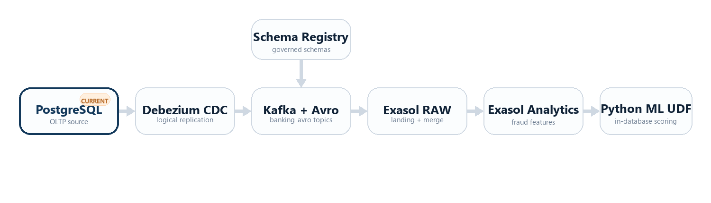

# Banking Analytics Pipeline

End-to-end pipeline: PostgreSQL OLTP → Kafka (CDC via Debezium) → Exasol OLAP → ML UDFs

## Demo Video


[Watch or download the MP4 demo](docs/assets/realtime-banking-fraud-detection.mp4)

## Architecture



```text
PostgreSQL (OLTP)
  -> Debezium CDC (WAL)
  -> Kafka + Avro + Schema Registry
  -> Exasol RAW / CLEANSED / ANALYTICS
  -> Python ML UDF (Fraud scoring)
```

## Additional Docs

- [Technical Architecture](docs/architecture-technical.md)
- [Fraud Features Guide](docs/fraud-features-guide.md)

## Quick Start

```bash
cp .env.example .env
# edit .env and set your PostgreSQL, Debezium, and Exasol credentials
docker compose up -d --build
bash deploy.sh
```

```powershell
Copy-Item .env.example .env
# edit .env and set your PostgreSQL, Debezium, and Exasol credentials
docker compose up -d --build
pwsh -File .\deploy.ps1
```

By default, `docker-compose.yml` provisions PostgreSQL, Kafka, Zookeeper, Schema Registry, Kafka Connect, and Kafka UI so the demo stack starts in one go.

Exasol is treated as an external analytical target. The supported Kafka-to-Exasol path in this repo is the official Exasol Kafka connector through BucketFS-hosted UDFs.

## Prerequisites

Before running the Exasol-side steps, make sure you have:

- a local `.env` file created from `.env.example`
- an Exasol database you can connect to over SQL
- BucketFS write access to upload the Kafka connector JAR and `fraud_model.pkl`
- BucketFS published on `2580` or `2581` if you are uploading from your host machine
- if Exasol runs in Docker, run `bash prepare_exasol_docker.sh` or `pwsh -File .\prepare_exasol_docker.ps1` so `kafka` and `schema-registry` resolve inside the Exasol container

The repo is Avro-only. Start it with:

```bash
bash deploy.sh
```

```powershell
pwsh -File .\deploy.ps1
```

If you want to reuse an existing PostgreSQL container instead of the built-in one, run:

```bash
USE_EXTERNAL_POSTGRES=true bash deploy.sh
```

## Project Structure

```
├── docker-compose.yml              # Self-contained local demo stack
├── docs/                           # Technical + customer-facing architecture notes
├── kafka_connect/Dockerfile        # Custom Debezium Connect image with Avro converter jars
├── deploy.sh                       # Bootstrap script
├── deploy.ps1                      # Windows-native bootstrap script
├── demo_dashboard.py               # Streamlit demo UI for inserting transactions and showing pipeline state
├── 01_schema.sql                   # PostgreSQL OLTP schema
├── 02_seed.sql                     # PostgreSQL seed data
├── init_replication.sh             # Debezium replication user + publication
├── debezium-connector.avro.json    # Debezium CDC with Avro + Schema Registry
├── debezium-connector.external.avro.json # External postgres + Avro + Schema Registry
├── 01_exasol_schema.sql            # RAW / CLEANSED / ANALYTICS schemas
├── 03_exasol_kafka_connector_schema.sql # Official connector staging tables
├── 04_exasol_kafka_connector_udfs.sql   # Official connector UDF setup
├── 05_exasol_kafka_connector_import_avro.sql # Avro import via Schema Registry
├── 06_exasol_kafka_connector_merge.sql  # Merge stage tables into RAW
├── 02_features_and_udfs.sql        # Simple fraud scoring UDF + in-database scoring SQL
├── 07_refresh_analytics_features.sql # Build CLEANSED + ANALYTICS training data
├── requirements.txt                # Python dependencies for model training
├── train_pipeline.py               # Simple fraud model training pipeline
└── connectors/                     # Drop Kafka Connect plugin jars here
```

## Default Deployment

The default path is:

- `docker compose up -d --build`
- `bash deploy.sh`
- PostgreSQL is created automatically on `localhost:5432`
- the banking schema and seed data are loaded automatically
- Kafka, Kafka Connect, Schema Registry, and Kafka UI start in the same stack
- Exasol imports Kafka topics through the official Exasol Kafka connector

This is the recommended setup for a GitHub demo or customer showcase because it removes local database preconditions and Debezium replication surprises.

Important format note:

- Debezium publishes Avro only
- Exasol imports from `banking_avro.public.*` only

## Demo Dashboard

For a customer demo, you can use the Streamlit dashboard instead of inserting rows manually.

This dashboard is a lightweight demo control surface for the full pipeline. It lets you create a banking transaction in PostgreSQL, watch the same event move through Kafka and into Exasol, and then show the final fraud score in a single UI.

The dashboard now also runs inside the same Docker Compose stack, so you can launch the full demo environment without a separate Python virtual environment. By default it is exposed at `http://localhost:8501`.

Install the Python dependencies:

```bash
pip install -r requirements.txt
```

Start the dashboard:

```bash
python -m streamlit run demo_dashboard.py
```

Or use the Dockerized dashboard that is part of the main compose stack:

```bash
docker compose up -d --build demo-dashboard
```

If Exasol is external, set `CONTAINER_EXASOL_DSN` in `.env` to an address reachable from inside Docker. For the common local setup where Exasol is published on the host, use `host.docker.internal:8563`.

The dashboard lets you:

- insert a new transaction into PostgreSQL
- optionally trigger the Exasol import, merge, analytics refresh, and fraud scoring steps
- view the same transaction across PostgreSQL, `KAFKA_STAGE`, `RAW`, and `ANALYTICS.FRAUD_FEATURES`
- show the top scored transactions for the demo

Use it together with Kafka UI in the browser at `http://localhost:8080` so you can show the Debezium event appearing in Kafka between the PostgreSQL insert and the Exasol import.

## Setup Commands

Default local demo stack:

```bash
cp .env.example .env
# edit .env
docker compose up -d --build
bash deploy.sh
```

```powershell
Copy-Item .env.example .env
# edit .env
docker compose up -d --build
pwsh -File .\deploy.ps1
```

Optional external PostgreSQL mode:

```bash
cp .env.example .env
# edit the EXTERNAL_POSTGRES_* values in .env
USE_EXTERNAL_POSTGRES=true bash deploy.sh
```

```powershell
Copy-Item .env.example .env
# edit the EXTERNAL_POSTGRES_* values in .env
$env:USE_EXTERNAL_POSTGRES = 'true'
pwsh -File .\deploy.ps1 -UseExternalPostgres
```

Official Exasol Kafka connector mode:

```bash
bash deploy.sh
```

```powershell
pwsh -File .\deploy.ps1
```

## Advanced External Postgres Mode

If you explicitly want to reuse an existing PostgreSQL container, run:

```bash
cp .env.example .env
# edit the EXTERNAL_POSTGRES_* values in .env
USE_EXTERNAL_POSTGRES=true bash deploy.sh
```

```powershell
Copy-Item .env.example .env
# edit the EXTERNAL_POSTGRES_* values in .env
$env:USE_EXTERNAL_POSTGRES = 'true'
pwsh -File .\deploy.ps1 -UseExternalPostgres
```

For that mode, the external Postgres instance must have:

- `wal_level=logical`
- the banking source tables loaded into the target database

Example bootstrap for an external container:

```bash
docker exec -i <YOUR_EXTERNAL_POSTGRES_CONTAINER> psql -U <YOUR_EXTERNAL_POSTGRES_PSQL_USER> -d <YOUR_EXTERNAL_POSTGRES_DB> < 01_schema.sql
docker exec -i <YOUR_EXTERNAL_POSTGRES_CONTAINER> psql -U <YOUR_EXTERNAL_POSTGRES_PSQL_USER> -d <YOUR_EXTERNAL_POSTGRES_DB> < 02_seed.sql
```

## Exasol Sync

The supported Kafka-to-Exasol path in this repo is the official Exasol Kafka connector.

## Official Exasol Kafka Connector Mode

The official Exasol Kafka connector is not a Kafka Connect sink plugin. It is the Exasol-supported `kafka-connector-extension` that runs inside Exasol through BucketFS-hosted UDFs.

Then, in Exasol:

1. Run `01_exasol_schema.sql`
2. Run `03_exasol_kafka_connector_schema.sql`
3. Upload the connector JAR to BucketFS
4. If Exasol itself runs in Docker, run:

```powershell
pwsh -File .\prepare_exasol_docker.ps1
```

```bash
bash prepare_exasol_docker.sh
```

5. Run `04_exasol_kafka_connector_udfs.sql`
6. Run `05_exasol_kafka_connector_import_avro.sql`
7. Run `06_exasol_kafka_connector_merge.sql`
8. Run `07_refresh_analytics_features.sql`

Important notes:

- The official connector imports append-only records, so this repo lands them in `KAFKA_STAGE.*`
- `06_exasol_kafka_connector_merge.sql` keeps the latest row per business key and applies deletes into `RAW.*`
- `07_refresh_analytics_features.sql` builds the training dataset in `ANALYTICS.FRAUD_FEATURES`
- `04_exasol_kafka_connector_udfs.sql` is prewired to `/buckets/bfsdefault/default/drivers/exasol-kafka-connector-extension-1.7.16.jar`
- The import SQLs use `kafka:9092` and `schema-registry:8081`; `prepare_exasol_docker.sh` or `prepare_exasol_docker.ps1` makes those names resolvable from the Exasol container

### Avro + Schema Registry

Kafka Connect uses a custom image that includes Confluent Avro converter jars, Debezium registers schemas in `http://schema-registry:8081`, and Exasol uses `05_exasol_kafka_connector_import_avro.sql`.

BucketFS upload example:

```bash
curl -X PUT -T exasol-kafka-connector-extension-1.7.16.jar \
  http://w:<WRITE_PASSWORD>@<EXASOL_DATANODE>:2580/<BUCKET_NAME>/
```

## Verification Commands

```bash
curl http://localhost:8083/connectors/banking-postgres-cdc-avro/status
```

List Kafka topics:

```bash
docker exec banking-kafka kafka-topics \
  --bootstrap-server localhost:9092 \
  --list
```

Watch Kafka messages from the Avro transactions topic:

```bash
docker exec banking-kafka kafka-console-consumer \
  --bootstrap-server localhost:9092 \
  --topic banking_avro.public.transactions \
  --from-beginning
```

Insert a test transaction into PostgreSQL:

```bash
docker exec banking-postgres psql -U <YOUR_POSTGRES_USER> -d <YOUR_POSTGRES_DB> -c "
INSERT INTO public.transactions
(txn_id, account_id, card_id, txn_type, amount, currency, direction, merchant_name, merchant_mcc, channel, country_code, city, status, reference_id, initiated_at, settled_at)
VALUES
('d4000000-0000-0000-0000-000000000012','b2000000-0000-0000-0000-000000000001','c3000000-0000-0000-0000-000000000001','PURCHASE',49.99,'USD','DR','Connector Smoke Test','5999','ONLINE','US','Austin','SETTLED','EXASOL-CONNECTOR-TEST',CURRENT_TIMESTAMP,CURRENT_TIMESTAMP);
"
```

Run the Exasol import and merge SQL, then query Exasol to confirm the row landed:

```bash
exaplus \
  -c "<YOUR_EXASOL_CONNECTION_STRING>" \
  -u <YOUR_EXASOL_USER> -p <YOUR_EXASOL_PASSWORD> \
  -sql "SELECT TXN_ID, REFERENCE_ID, CHANNEL, CITY FROM RAW.TRANSACTIONS WHERE REFERENCE_ID = 'EXASOL-CONNECTOR-TEST';"
```

## Kafka Topics (produced by Debezium)

| Topic                          | Source Table     |
|-------------------------------|-----------------|
| banking_avro.public.transactions | transactions  |
| banking_avro.public.accounts     | accounts      |
| banking_avro.public.customers    | customers     |
| banking_avro.public.cards        | cards         |
| banking_avro.public.fraud_alerts | fraud_alerts  |

## ML Models

| Model              | Algorithm           | Target            | Stored In      |
|--------------------|---------------------|-------------------|----------------|
| `fraud_model.pkl`  | Logistic Regression | Is fraud? (0/1)   | BucketFS       |

## ML Training Flow

1. Import Kafka data into Exasol:
   - `05_exasol_kafka_connector_import_avro.sql`
   - `06_exasol_kafka_connector_merge.sql`
2. Build the ML training set:
   - `07_refresh_analytics_features.sql`
3. Train the model locally:

```bash
export EXASOL_DSN=<YOUR_EXASOL_DSN>
export EXASOL_USER=<YOUR_EXASOL_USER>
export EXASOL_PASSWORD=<YOUR_EXASOL_PASSWORD>
python train_pipeline.py --source auto
```

Recommended training modes:

- `--source auto`: use Exasol labels when there is enough history, otherwise fall back to hybrid or synthetic
- `--source hybrid`: always blend Exasol labels with synthetic rows so the demo can train even with a tiny fraud history
- `--source exasol`: real Exasol labels only; fails fast if `ANALYTICS.FRAUD_FEATURES` is still too small

This simplified demo intentionally uses one fraud model only. The goal is to show a clear story:

- build fraud features in Exasol
- train one small model
- upload one `.pkl` file to BucketFS
- score transactions inside Exasol with one Python UDF

The fraud UDF is model-only. If `fraud_model.pkl` is missing from BucketFS, scoring fails instead of falling back to rules.

The seed data includes a small resolved alert history, so after `07_refresh_analytics_features.sql` you should see a few labeled rows in `ANALYTICS.FRAUD_FEATURES`. For demo-quality models, `--source hybrid` is still the practical default until you accumulate more investigated alerts.

Useful overrides:

```bash
export EXASOL_DSN=<YOUR_EXASOL_DSN>
export EXASOL_USER=<YOUR_EXASOL_USER>
export EXASOL_PASSWORD=<YOUR_EXASOL_PASSWORD>
python train_pipeline.py \
  --source hybrid \
  --min-labeled-rows 2000 \
  --min-positive-labels 50
```

The training script writes:

- `models/fraud_model.pkl`
- `models/training_report.json`

If `ANALYTICS.FRAUD_FEATURES` is empty, run `07_refresh_analytics_features.sql` first.

## BucketFS Upload

```bash
curl -X PUT -T models/fraud_model.pkl \
  http://YOUR_EXASOL_HOST:2580/models/fraud_model.pkl
```

If your existing Exasol container does not publish port `2580`, BucketFS uploads will fail until that port is exposed.

## Running the ML UDFs in Exasol

After uploading the model file to BucketFS:

1. Run `02_features_and_udfs.sql`
2. Execute the batch scoring step at the end of that file to populate `FRAUD_SCORE` and `MODEL_VERSION`

```sql
-- Score a single transaction
SELECT ANALYTICS.FRAUD_SCORE_UDF(
    1250.00, 3, 8, 2800.00, 9500.00, 4.2,
    TRUE, TRUE, FALSE, TRUE, FALSE, 0.15
);

-- Batch score all pending transactions
-- (run 02_features_and_udfs.sql Step 1c)
```

## Monitoring

- **Kafka UI**: http://localhost:8080 — topic lag, consumer groups, connector status
- **Kafka Connect REST**: http://localhost:8083/connectors
- **Schema Registry**: http://localhost:8081/subjects
